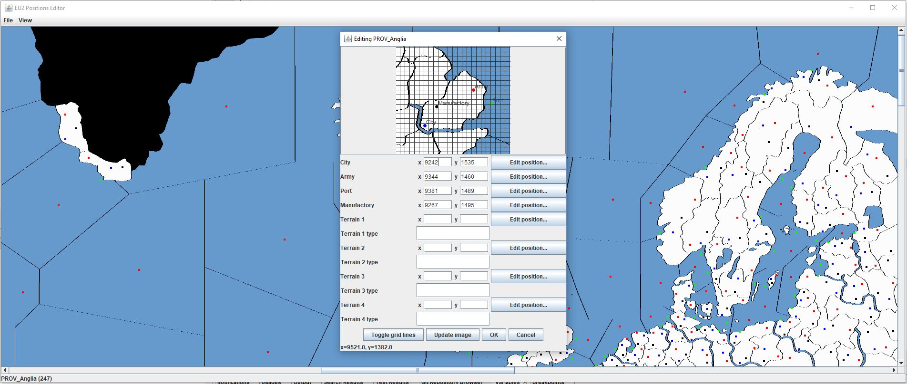

### For the Glory Positions Editor

This program runs on an installation of either For the Glory or Europa Universalis II and allows a skilled user to edit the positions of sprites on the map.

(click for the full image)

This is very useful for map modders. Most players and even most modders will never need this tool.

This tool is a work in progress, based on code from before For the Glory existed. Reading and writing province sprite positions is now fully supported in both EU2 and FTG, but bugs are likely. Always back up important game files.
